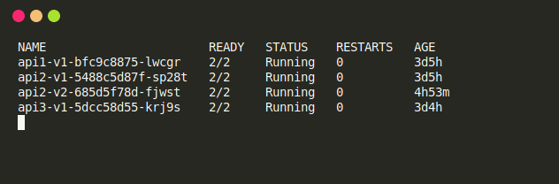
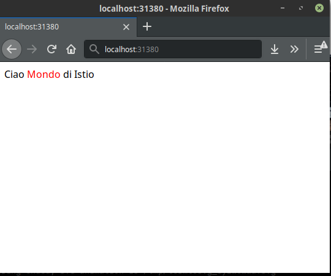
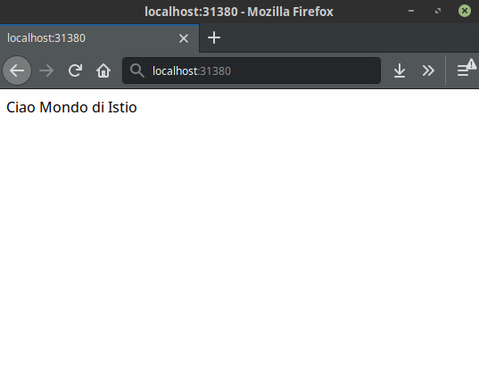
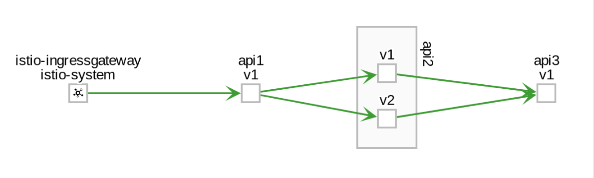

#  Api2 versione 2 e A/B Testing

In questo esempio vogliamo mettere su k8s la seconda versione di api2 e vogliamo esporre al pubblico [test A/B]

### Prerequisito
Prima di andare avanti dovete rendere eseguibile il secondo script
```
sudo chmod +x build-v2.sh
```  

### Installazione
L' installazione di questa versione è quasi analoga di quello principale basta lanciare il seguente script:
```
./buildv2.sh
```  
Una volta eseguito lo script possiamo notare una seconda immagine di api2 ma con una diversa versione.
Adesso dobbiamo fare un deployment di questa versione su k8s, quindi:
```
kubectl apply -f api2-ver2.yml -n <NAMESPACE>
```
A questo punto controlliamo che il pod  della seconda versione è in running attraverso questo comando:
```
kubectl get pod -n <NAMESPACE> --watch
```


Adesso verifichiamo se ci risponde il servizio Api2 chiamando l'endpoint iniziale sul browser.



Però se aggiorniamo esce la prima versione  



### Cosa succede?
Quando Api1 chiama il servizio Api2, istio smista le chiamate tra le versioni di api2, che si può vedere anche da questo grafo:



## Conclusione
In questo esempio possiamo vedere subito un caso di **Testing A/B** dove possiamo testare le versioni di un microservizio e valutare da quale scegliere successivamente.
