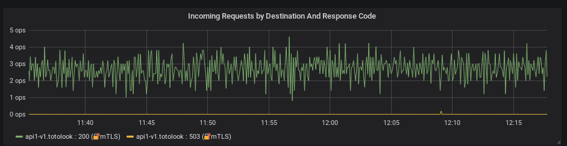

# Esempio di Istio


Un progetto di esempio per partire su Istio

Clonare questa repo sulla macchina di sviluppo dove si trova kubernetes oppure in locale


```

git clone https://almatoolbox.visualstudio.com/eGov-Connect/_git/istio-starter-pack
cd istio-starter-pack
sudo chmod +x build.sh

```


### Prerequisiti


Per funzionare questo esempio si deve avere:

*  [Maven](https://maven.apache.org/) - Dependency Management

- [Java JDK 8](https://www.oracle.com/technetwork/java/javase/downloads/jdk8-downloads-2133151.html)

- [Docker](https://docs.docker.com/install/linux/docker-ce) - Docker Registry

- Kubernetes/Rancher oppure kubectl remoto

- [Istio](https://istio.io/docs/setup/kubernetes/install/kubernetes/ ) - deployato su K8s

***Assicuratevi che istio abbia l'injection automatico sul namespace desiderato*** se no dovete applicare una label del vostro namespace:
```
kubectl label namespace <namespace> istio-injection=enabled
```


### Installazione

  Per partire si deve eseguire lo script per la compilazione e creazione del immagine di docker

```
./build.sh
```
Si può aggiungure già dei parametri sullo script
```
./build.sh <VERSIONE> [push] <REGISTRY URL>
```


**Attenzione!** Prima di proseguire verificate se avete cambiato il registry oppure la versione, dovete modificare successivamente il file **apik8s.yml** e modificare l'immagine di ogni api
```
 image: localhost:32000/api1:lastest
 image: localhost:32000/api2:lastest
 image: localhost:32000/api3:lastest
```
con
```
 image: <REGISTRY URL>/api1:<VERSIONE>
 image: <REGISTRY URL>/api2:<VERSIONE>
 image: <REGISTRY URL>/api3:<VERSIONE>
```


Adesso si passa al deploy dei microservizi attraverso kubectl
```
kubectl apply -f apik8s.yml
```

Aspettiamo che i microservizi che girano. Poi diamo impasto la configurazione del gateway e il virtualService per accettare le connessioni in ingresso.

```
kubectl apply -f apinet.yml
```


Adesso si deve raggiungere il servizio api1, ma prima vediamo la porta che ci ha dato l'ingress di istio:
```

kubectl get svc  istio-ingressgateway -n istio-system
NAME                   TYPE       CLUSTER-IP     EXTERNAL-IP   PORT(S)
istio-ingressgateway   NodePort   10.43.222.56   <none>        80:31380/TCP,443:31390/TCP,31400:31400/TCP

```
quindi per contattare il servizio **api1**, ricordiamo che sta sulla porta 80, dobbiamo andare sulla corrispondenza della porta in uscita.
In questo caso è 31380, adesso facciamo un test se ci connettiamo.
 ```
 curl  -v localhost:31380/
```


________________________________________________________________________________
## Migrazione su mTLS
Si può mettere anche in sicurezza i microservizi con una mutua TLS senza implementare direttamente sui microservizi.

### Destination Rules
Dopo aver installato e configurato i vari microservizi si deve applicare le regole di destinazioni per dire ai microservizi che devono instaurare una mutua TLS su tutte i tre servizi, quindi dobbiamo applicare questo yaml.
```
kubectl apply -f apiDestinationRules.yml
```

Infatti stiamo dicendo ad istio di fare una mutua tls:
```
spec:
  host: api1.default.svc.cluster.local
  trafficPolicy:
    tls:
      mode: ISTIO_MUTUAL
```
### Ricevere solo mTLS (*Opzionale*)
Dopo aver applicato le regole di destinazioni possiamo forzare un servizio che
dovrà accettare solo le connessioni tramite mTLS.
```
kubectl apply -f apiPolicy.yml
```
Questo è il risultato:



## Risultato finale
Con questo esempio abbiamo fatto comunicare i tre microservizi e messi in sicurezza con la mutua tls senza modificare i microservizi


## Altro
* [Update Api2 ](doc/upgradeApi2.md) - Aggiungure la seconda versione del Api2 e vedere cosa comporta.
 
 * [Aggiungere un WSO2 Itegrator](wso2ei/wso2-esb.md) - Aggiungere servizio wso2 integrator.

## Costruito con


*  [Springboot](https://spring.io/projects/spring-boot) - The web framework used

*  [Maven](https://maven.apache.org/) - Dependency Management


## Authors


*  **Antonio di Giovanni** - *Initial work* - [totolook](https://github.com/totolook)
