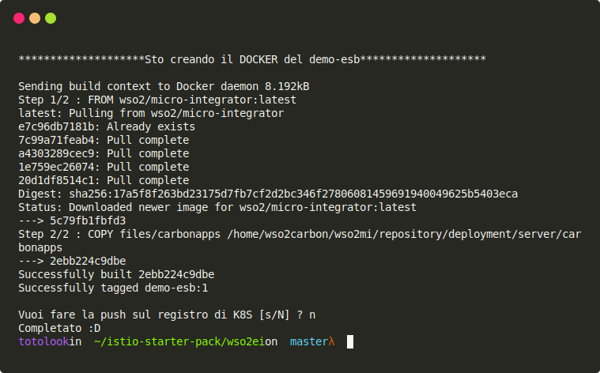
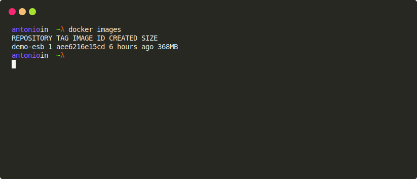

# Esempio integrator wso2
In questo esempio ci focalizziamo su istio e l'integrator di WSO2 e far coesistere i due servizi, api1 e wso2.

## Prerequisito
Eseguire questo esempio sulla macchina che ha il registry di Docker di Kubernets.

## Costruire l'immagine di docker
Ad questo punto costruiamo l'immagine contenente un car ad-hoc per questo esempio
```
./wso2ei/generate-image.sh
```
Si può aggiungure già dei parametri sullo script
```
./wso2ei/generate-image.sh <VERSIONE> [push] <REGISTRY URL>
```



Per essere sicuri che abbiamo caricato la nostra immagine possiamo eseguire il seguente commando:
```
docker images
```
Il risultato dovrebbe essere questo:



## Importare il deploy e il virtual service
 Non ci resta di applicare i script, quindi:
 ```
 kubectl apply -f wso2ei/script/
 ```
Ci sono due script in quella cartella la prima e di creare il deploy e l'altra e' una modifica del virtualService di api1.


## Test
Non ci resta di testare:

Vedere se funziona ancora api1
```
curl -v localhost:31380/
```

Chiamata al esb
```
curl -v localhost:31380/api
curl -v localhost:31380/api/security
```
